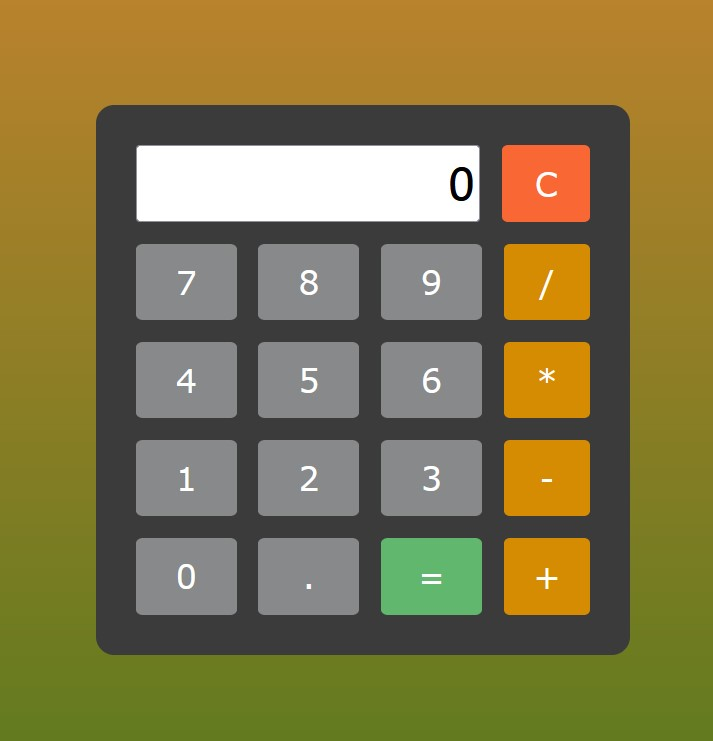

# Calculator

This is a simple on-screen calculator app. I made it to practice using HTML, CSS and JS. It was made using the following elements:

- CSS Flex
- CSS Grid
- Event listeners
- Query selectors
- For each loops
- Arrow functions
- Eval function

## Screenshot

## Deployment

The deployed app can be tested here: https://manonthemon.github.io/Calcuclator/

## Contributors

I coded this app myself, I avoided using tutorials. For more information contact me at klimowicz.maciej@gmail.com

